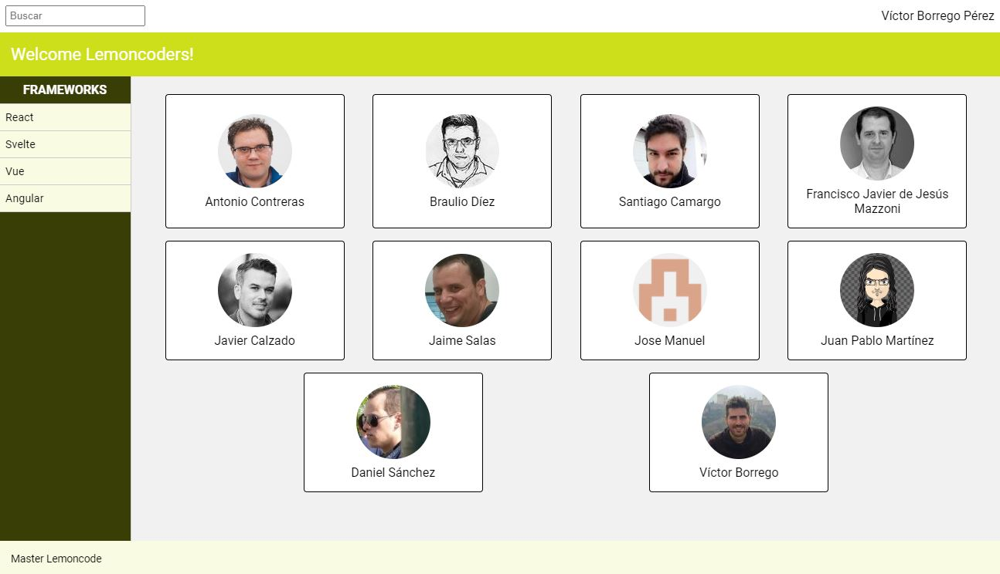

# Master Front End XVII - Módulo 1 - Layout - Laboratorio EXTRA

## Laboratorio EXTRA

Este laboratorio es EXTRA, y por tanto opcional, pero nuestro consejo es que los cubras todos.

Aquí tienes el enunciado:

[Modulo Layout - Laboratorio EXTRA](https://campus.lemoncode.net/api/student/assets/c29e717a609b00ef4cec2e06a4838765:302a5416261b0f030459b622590a3551:1a8e42b6639db2b7915d0abbfc47231e0e1b2abecac571cbc09949118a0fca1aead1e512894ff7d341ca2f1cc2babc3a3fc4c18b88fdc424ba671d178b49ced6268c52613391f1c960976fa0deb364ff3f6e0a303c91299c5dba3dfd1f50df5d4e37f8f13d356c2fc0832729a7fb0f94fa20a582d31293b8be862097637ae3f9cc85b21580c5276a5735dd36b5e8f1409d27eb02c26a930b043297aa86ae1de074732498dd5f9c39e20ee2fe057b?download=true)

Aquí tienes a modo de arranque el HTML base. Tiene todo lo necesario, pero puedes modificarlo según tus necesidades:

[index.html](https://workingful-lemoncode.s3.eu-west-3.amazonaws.com/campus/master-front-end-x/modulo-1-layout-laboratorio-extra/index.html?download=true)